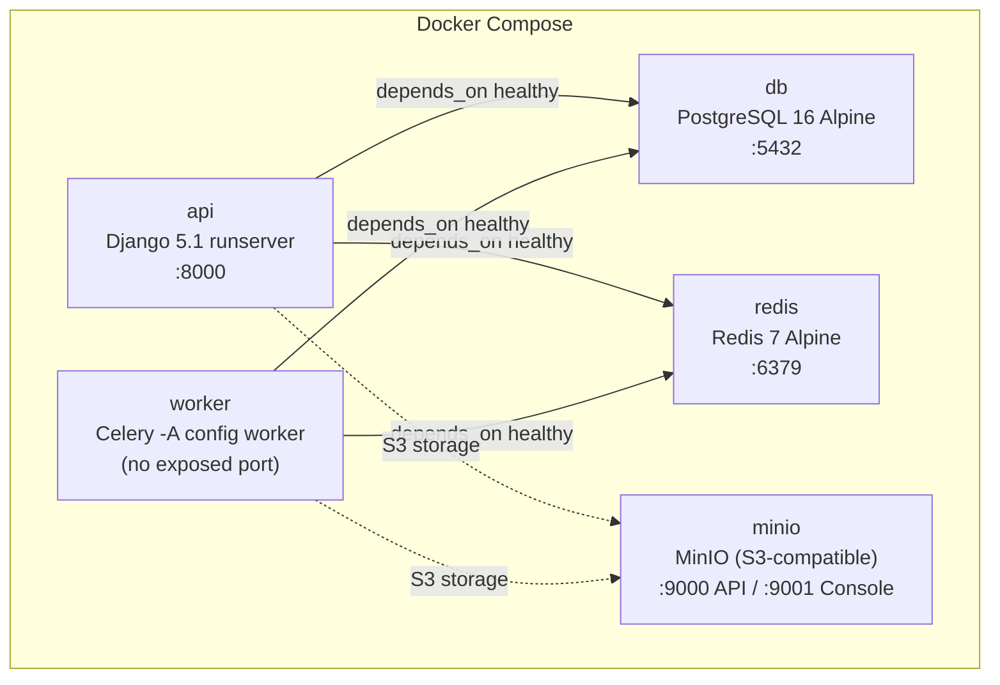
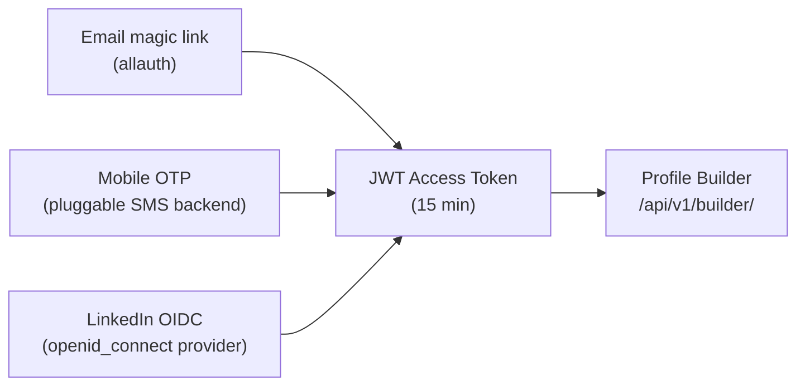
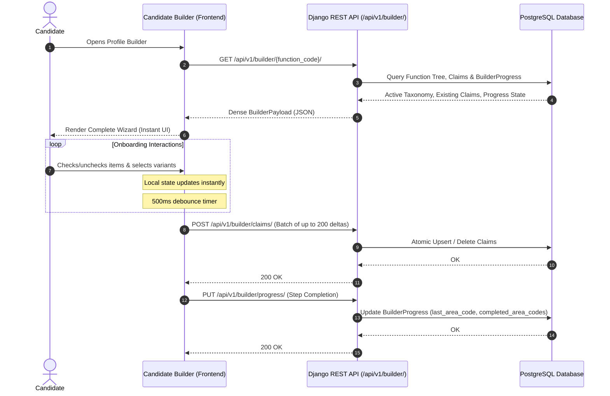
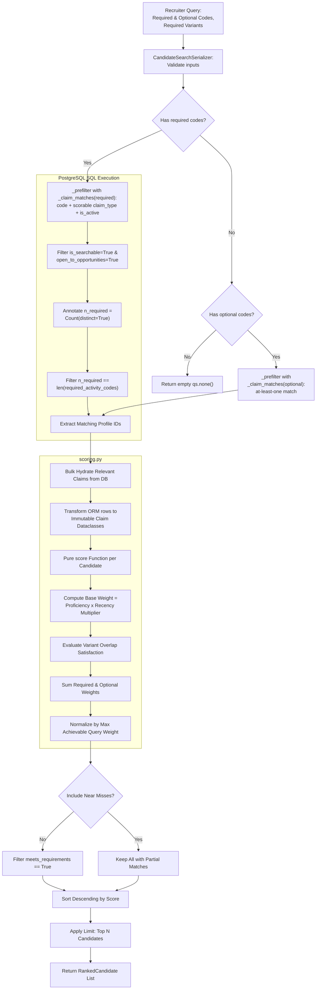
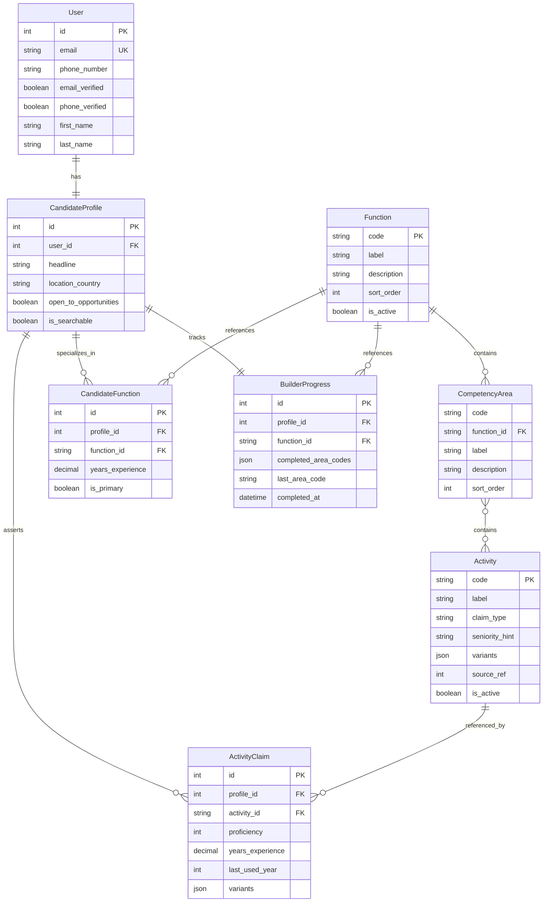

# Architecture & System Design

> Architectural principles, data flows, entity relationships, and performance guarantees for the HireRight talent intelligence platform.

---

## Table of Contents

- [Architectural Principles](#architectural-principles)
- [Infrastructure & Containerization](#infrastructure--containerization)
- [Authentication Architecture](#authentication-architecture)
- [System Architecture & Data Flows](#system-architecture--data-flows)
  - [1. Candidate Profile Builder Flow](#1-candidate-profile-builder-flow)
  - [2. Recruiter Search & Candidate Ranking Pipeline](#2-recruiter-search--candidate-ranking-pipeline)
- [Domain Entity Relationships](#domain-entity-relationships)
- [Design Decisions & Trade-Offs](#design-decisions--trade-offs)
  - [Pure Functional Scoring Engine](#pure-functional-scoring-engine)
  - [Soft Deactivation vs. Cascade Deletes](#soft-deactivation-vs-cascade-deletes)
  - [Dense Single-Fetch Payload Design](#dense-single-fetch-payload-design)
  - [Debounced Batch Synchronization](#debounced-batch-synchronization)
  - [Serializer-Layer Validation](#serializer-layer-validation)
  - [Atomic Batch Rejection](#atomic-batch-rejection)
- [Performance & Scalability Strategy](#performance--scalability-strategy)

---

## Architectural Principles

HireRight is built around five core architectural tenets:

1. **Functional Core, Imperative Shell**:
   The core scoring algorithm (`matching.scoring`) is a purely mathematical function without ORM, I/O, or network dependencies. All database queries, caching, and serialization live strictly in the outer boundary (`matching.search` and `api.v1.serializers`).
2. **Auditability & Immutable History**:
   Candidate claims represent formal professional assertions. Deleting an activity from the taxonomy must never invalidate historical candidate records or corrupt recruiter audit trails.
3. **Zero-Latency Candidate Onboarding**:
   The builder interface loads its complete working set in a single dense request and synchronizes state in debounced background batches, ensuring zero UI blockers during onboarding.
4. **Normalized & Comparable Matching Scores**:
   Match scores are normalized against the theoretical maximum score for that specific query, ensuring that candidate scores are comparable across diverse queries.
5. **Near-Miss Transparency**:
   Recruiters need to inspect high-potential candidates who satisfy core requirements but miss a single version variant or optional skill. The pipeline supports surfacing near-miss diagnostics alongside strict boolean filters.

---

## Infrastructure & Containerization

The development stack runs via Docker Compose (`docker-compose.yml`), with a shared `.env.example` at the repo root consumed by both Docker Compose and bare `manage.py runserver`.

| Service | Image | Port(s) | Volume | Healthcheck |
| :--- | :--- | :--- | :--- | :--- |
| `db` | `postgres:16-alpine` | `5432` | `pgdata` | `pg_isready` |
| `redis` | `redis:7-alpine` | `6379` | — | `redis-cli ping` |
| `minio` | `minio/minio` | `9000`, `9001` | `miniodata` | — |
| `api` | `apps/api/Dockerfile` | `8000` | bind mount `./apps/api:/app` | — |
| `worker` | `apps/api/Dockerfile` | — | bind mount `./apps/api:/app` | — |

The `api` and `worker` services share the same `Dockerfile` (Python 3.12-slim, `psycopg` compiled against `libpq-dev`). The worker overrides `CMD` with `celery -A config worker -l info`.

---

## Authentication Architecture

HireRight supports three candidate login paths and a separate recruiter service-to-service flow, all converging on a single canonical identity keyed by verified email.

### Custom User Model (`accounts.models.User`)

The `User` model drops `username` in favour of a unique `email`:

| Field | Type | Purpose |
| :--- | :--- | :--- |
| `email` | `EmailField(unique=True)` | Primary identifier (`USERNAME_FIELD`) |
| `phone_number` | `CharField` | E.164 format, for mobile OTP |
| `email_verified` | `BooleanField` | Set by `mark_email_verified()` |
| `phone_verified` | `BooleanField` | Set by `mark_phone_verified()` |

Account linking is automatic: a candidate who signs up via email and later uses LinkedIn lands in the same profile, because allauth matches on verified email.

### Candidate Login Paths

- **Email**: Passwordless magic link via `django-allauth`.
- **Mobile OTP**: Pluggable `SMSBackend` interface (`accounts/sms/backends.py`). `ConsoleSMSBackend` prints OTPs to stdout in development; production requires a real backend (Twilio, etc.) configured via `settings.SMS_BACKEND`.
- **LinkedIn**: Uses allauth's generic `openid_connect` provider, **not** the deprecated `linkedin_oauth2` which relied on retired v1 profile projections and `r_liteprofile` scopes.

### Token Architecture

| Consumer | Mechanism | Lifetime | Library |
| :--- | :--- | :--- | :--- |
| Candidate | JWT (Bearer) | 15 min access / 7 day rotating refresh | `dj-rest-auth` + `simplejwt` |
| Recruiter service | OAuth2 client-credentials | 1 hour | `django-oauth-toolkit` |

### Recruiter Search Scope

`POST /api/v1/search/` requires an OAuth2 access token carrying the `candidates:search` scope. A custom `HasRecruiterSearchScope` permission class enforces this — hand-rolled instead of `oauth2_provider.TokenHasScope` to prevent `500 ImproperlyConfigured` errors when non-OAuth2 requests hit the endpoint (returns a clean `403 Forbidden` instead).

---

## System Architecture & Data Flows

### 1. Candidate Profile Builder Flow

---

### 2. Recruiter Search & Candidate Ranking Pipeline

---

## Domain Entity Relationships

---

## Design Decisions & Trade-Offs

### Authentication & Identity
- **Decision**: The backend implements a custom `User` model (`apps/api/accounts/models.py`) with `username = None`, relying entirely on `email` as the unique identifier.
- **Decision**: Authentication uses JSON Web Tokens (JWT) via `dj-rest-auth` and `djangorestframework-simplejwt`, with session authentication explicitly disabled in the REST Framework.
- **Rationale**:
  - Drops legacy Django `username` cruft, which simplifies magic-link and OAuth2 social login paths.
  - Using pure JWT (`SESSION_LOGIN = False`) eliminates CSRF token friction for the decoupled Vite SPA.
  - A custom `RegisterSerializer` is provided to ensure strict email uniqueness checks since the default `dj-rest-auth` serializer skips DB-level email existence checks if `ACCOUNT_EMAIL_VERIFICATION` is optional.

### Pure Functional Scoring Engine
- **Decision**: `scoring.py` does not touch Django models or database connections. It receives plain Python dataclasses (`Claim`, `Query`) and outputs `MatchResult`.
- **Rationale**:
  - Eliminates accidental $N+1$ query regressions in inner scoring loops.
  - Allows comprehensive table-driven testing with zero database fixtures.
  - Makes it possible to swap or experiment with alternative ranking models without touching the API or persistence layer.

### Soft Deactivation vs. Cascade Deletes
- **Decision**: `ActivityClaim.activity` utilizes `on_delete=models.PROTECT`. When seeding removes an activity, the management command deactivates the record (`is_active=False`) via `--prune`.
- **Rationale**:
  - Candidate profile history and recruiter placement audits must remain immutable.
  - Prevents breaking external API consumers referencing legacy activity codes.

### Dense Single-Fetch Payload Design
- **Decision**: The candidate onboarding builder downloads the full function hierarchy, previous claims, and progress in one JSON response (`BuilderPayloadSerializer`).
- **Rationale**:
  - Eliminates network latency between wizard steps.
  - Enables instant offline UI rendering and snappy local interactions.
  - Reduces total server request volume during user onboarding.

### Debounced Batch Synchronization
- **Decision**: Frontends debounce tick operations (e.g. 500ms) and send arrays of claim deltas up to 200 items in a single HTTP `POST` to `ClaimBatchSerializer`.
- **Rationale**:
  - Reduces backend write traffic by $>80\%$ during rapid multi-select workflows.
  - `ClaimWriteSerializer` handles upserts and deletions (`claimed: false`) in a single atomic transaction.

### Serializer-Layer Validation
- **Decision**: All input validation happens in DRF serializers (`api/v1/serializers.py`), not in model `clean()` methods.
- **Rationale**:
  - The write path uses `update_or_create`, which bypasses `full_clean()`. Anything not checked at the serializer layer would reach the database unchecked.
  - Serializer validation produces structured field-level error responses (`400` with field names) rather than unhandled `ValidationError` exceptions.

### Atomic Batch Rejection
- **Decision**: `ClaimBatchView` rejects the entire batch with `400` if any single claim has an unknown activity code, inactive activity, or invalid variant — rather than partially applying valid claims.
- **Rationale**:
  - A partial success would report `synced_count` while silently dropping a candidate's answer, which violates the "never lose work" principle.
  - The frontend can safely retry the full batch on failure without risk of duplicating already-applied claims (upsert semantics via `UniqueConstraint`).

---

## Performance & Scalability Strategy

1. **SQL-Level Aggregated Pre-filtering**:
   Instead of retrieving thousands of profiles to score in Python, `search.py` issues a SQL query with `Count(distinct=True)` to narrow candidate IDs down to only those meeting required codes before loading claim rows. The `_claim_matches()` helper ensures the pre-filter and scorer agree on which claim types are scorable.
2. **Compound Composite Indexes**:
   - `(activity_id, profile_id)` on `ActivityClaim` for high-throughput recruiter reverse lookups.
   - `(profile_id, activity_id)` on `ActivityClaim` for candidate profile hydration.
3. **In-Memory Score Normalization**:
   Scoring and ranking for a pre-filtered batch of 50–200 candidates takes $<2\,\text{ms}$ in Python, easily fitting within interactive web request budgets.
4. **Empty Query Guard**:
   An unconstrained search (no required or optional codes) returns `qs.none()` at the pre-filter level and `400` at the serializer level, preventing accidental full-table scans.

## Frontend Architecture (Vite SPA)

The Candidate Profile Builder is a pure Single Page Application (SPA) located in `apps/web/`.

- **Tech Stack**: React 19, Vite, TypeScript, Tailwind CSS v4, shadcn/ui.
- **Testing**: UI components and routing are tested using Vitest, jsdom, and React Testing Library, allowing for fast, headless DOM verification of API mocking and state transitions.
- **State Management**: Zustand manages the dense taxonomy tree and user claims in local memory, enabling sub-millisecond UI reactions (e.g. implicit claiming) without waiting on network requests.
- **Debounced Syncing**: The `use-claim-sync` hook batches user interactions into atomic `ClaimBatch` payloads, emitting a background POST to the Django API after 500ms of inactivity.
- **Proxy**: In development, Vite proxies `/api` to `localhost:8000` to bypass CORS. In production, the built static files are served via CDN/Nginx, consuming the API over HTTPS.

## AI Resume Parsing Architecture
The resume parsing pipeline delegates heavy lifting to a background queue to prevent blocking user requests.
*   **Storage Backend**: S3-compatible object storage (MinIO locally, AWS S3 in production) holds the uploaded PDFs.
*   **Message Broker**: Redis handles message routing for Celery.
*   **LLM Provider**: The `google-genai` SDK interfaces with Gemini (`gemini-2.5-flash`) for rapid, structured extraction using `response_mime_type: 'application/json'`.
*   **Data Flow**:
    1.  Client POSTs multipart form data to `/api/v1/profile/resume/` with `functionCode`.
    2.  Django saves file to MinIO and enqueues `profile_id` & `functionCode` to Celery.
    3.  Celery downloads PDF, extracts text, fetches relevant taxonomy subset, queries Gemini.
    4.  Gemini returns JSON `{"codes": [...]}`.
    5.  Celery creates `ActivityClaim` rows. Frontend re-fetches payload to display results.

### A Resume's Lifecycle Example
To trace the exact flow of data:
1. **MinIO**: `Jane_Doe_CV.pdf` is uploaded and saved to `s3://hiredright/resumes/Jane_Doe_CV_x8f9a2.pdf`.
2. **Postgres**: The `CandidateProfile.resume` column stores the relative path string `resumes/Jane_Doe_CV_x8f9a2.pdf`.
3. **Redis**: The `parse_resume_task` job is pushed to the queue with args `[profile_id=42, functionCode="clinical-operations"]`.
4. **Celery**: The worker pulls the file directly from MinIO, parses it with `pypdf`, and queries Gemini.
5. **LLM**: Gemini replies with `{"codes": ["clin_ops_trial_master_file", "clin_ops_edc_entry"]}`.
6. **Postgres**: Celery loops and provisions `ActivityClaim` rows for those specific codes.
