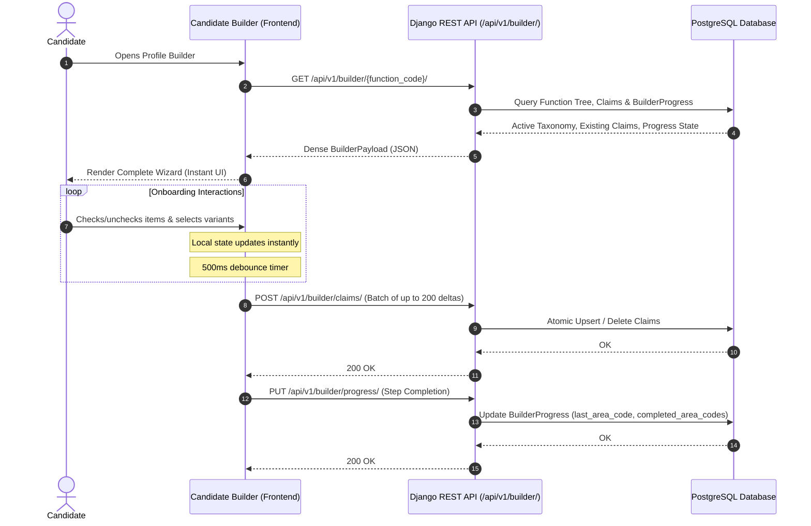
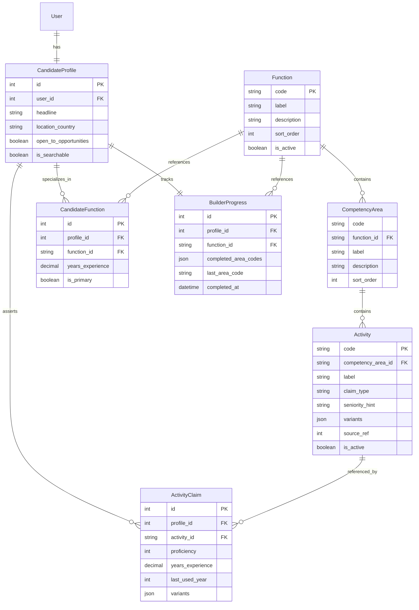

# Architecture & System Design

> Architectural principles, data flows, entity relationships, and performance guarantees for the HireRight talent intelligence platform.

---

## Table of Contents

- [Architectural Principles](#architectural-principles)
- [System Architecture & Data Flows](#system-architecture--data-flows)
  - [1. Candidate Profile Builder Flow](#1-candidate-profile-builder-flow)
  - [2. Recruiter Search & Candidate Ranking Pipeline](#2-recruiter-search--candidate-ranking-pipeline)
- [Domain Entity Relationships](#domain-entity-relationships)
- [Design Decisions & Trade-Offs](#design-decisions--trade-offs)
  - [Pure Functional Scoring Engine](#pure-functional-scoring-engine)
  - [Soft Deactivation vs. Cascade Deletes](#soft-deactivation-vs-cascade-deletes)
  - [Dense Single-Fetch Payload Design](#dense-single-fetch-payload-design)
  - [Debounced Batch Synchronization](#debounced-batch-synchronization)
- [Performance & Scalability Strategy](#performance--scalability-strategy)

---

## Architectural Principles

HireRight is built around five core architectural tenets:

1. **Functional Core, Imperative Shell**:
   The core scoring algorithm (`matching.scoring`) is a purely mathematical function without ORM, I/O, or network dependencies. All database queries, caching, and serialization live strictly in the outer boundary (`matching.search` and `api.v1.serializers`).
2. **Auditability & Immutable History**:
   Candidate claims represent formal professional assertions. Deleting an activity from the taxonomy must never invalidate historical candidate records or corrupt recruiter audit trails.
3. **Zero-Latency Candidate Onboarding**:
   The builder interface loads its complete working set in a single dense request and synchronizes state in debounced background batches, ensuring zero UI blockers during onboarding.
4. **Normalized & Comparable Matching Scores**:
   Match scores are normalized against the theoretical maximum score for that specific query, ensuring that candidate scores are comparable across diverse queries.
5. **Near-Miss Transparency**:
   Recruiters need to inspect high-potential candidates who satisfy core requirements but miss a single version variant or optional skill. The pipeline supports surfacing near-miss diagnostics alongside strict boolean filters.

---

## System Architecture & Data Flows

### 1. Candidate Profile Builder Flow



---

### 2. Recruiter Search & Candidate Ranking Pipeline

```mermaid
flowchart TD
    A[Recruiter Query: Required & Optional Codes, Required Variants] --> B[search.py: _prefilter]
    
    subgraph Database Layer [PostgreSQL SQL Execution]
        B --> C[Filter is_searchable=True & open_to_opportunities=True]
        C --> D[Filter claims__activity__code__in Required Codes]
        D --> E["Annotate n_required = Count(distinct=True)"]
        E --> F[Filter n_required == len(required_activity_codes)]
        F --> G[Extract Matching Candidate Profile IDs]
    end

    G --> H[Bulk Hydrate Relevant Claims from DB]
    
    subgraph Pure Functional Layer [scoring.py]
        H --> I[Transform ORM rows to Immutable Claim Dataclasses]
        I --> J[Pure score Function per Candidate]
        J --> K[Compute Base Weight = Proficiency * Recency Multiplier]
        K --> L[Evaluate Variant Overlap Satisfaction]
        L --> M[Sum Required & Optional Weights]
        M --> N[Normalize by Max Achievable Query Weight]
    end

    N --> O{Include Near Misses?}
    O -- No --> P[Filter meets_requirements == True]
    O -- Yes --> Q[Keep All with Partial Matches]
    
    P --> R[Sort Descending by Score]
    Q --> R
    R --> S[Apply Limit: Top N Candidates]
    S --> T[Return RankedCandidate List]
```

---

## Domain Entity Relationships



---

## Design Decisions & Trade-Offs

### Pure Functional Scoring Engine
- **Decision**: `scoring.py` does not touch Django models or database connections. It receives plain Python dataclasses (`Claim`, `Query`) and outputs `MatchResult`.
- **Rationale**:
  - Eliminates accidental $N+1$ query regressions in inner scoring loops.
  - Allows comprehensive table-driven testing with zero database fixtures.
  - Makes it possible to swap or experiment with alternative ranking models without touching the API or persistence layer.

### Soft Deactivation vs. Cascade Deletes
- **Decision**: `ActivityClaim.activity` utilizes `on_delete=models.PROTECT`. When seeding removes an activity, the management command deactivates the record (`is_active=False`) via `--prune`.
- **Rationale**:
  - Candidate profile history and recruiter placement audits must remain immutable.
  - Prevents breaking external API consumers referencing legacy activity codes.

### Dense Single-Fetch Payload Design
- **Decision**: The candidate onboarding builder downloads the full function hierarchy, previous claims, and progress in one JSON response (`BuilderPayloadSerializer`).
- **Rationale**:
  - Eliminates network latency between wizard steps.
  - Enables instant offline UI rendering and snappy local interactions.
  - Reduces total server request volume during user onboarding.

### Debounced Batch Synchronization
- **Decision**: Frontends debounce tick operations (e.g. 500ms) and send arrays of claim deltas up to 200 items in a single HTTP `POST` to `ClaimBatchSerializer`.
- **Rationale**:
  - Reduces backend write traffic by $>80\%$ during rapid multi-select workflows.
  - `ClaimWriteSerializer` handles upserts and deletions (`claimed: false`) in a single atomic transaction.

---

## Performance & Scalability Strategy

1. **SQL-Level Aggregated Pre-filtering**:
   Instead of retrieving thousands of profiles to score in Python, `search.py` issues a SQL query with `Count(distinct=True)` to narrow candidate IDs down to only those meeting required codes before loading claim rows.
2. **Compound Composite Indexes**:
   - `(activity_id, profile_id)` on `ActivityClaim` for high-throughput recruiter reverse lookups.
   - `(profile_id, activity_id)` on `ActivityClaim` for candidate profile hydration.
3. **In-Memory Score Normalization**:
   Scoring and ranking for a pre-filtered batch of 50–200 candidates takes $<2\,\text{ms}$ in Python, easily fitting within interactive web request budgets.
